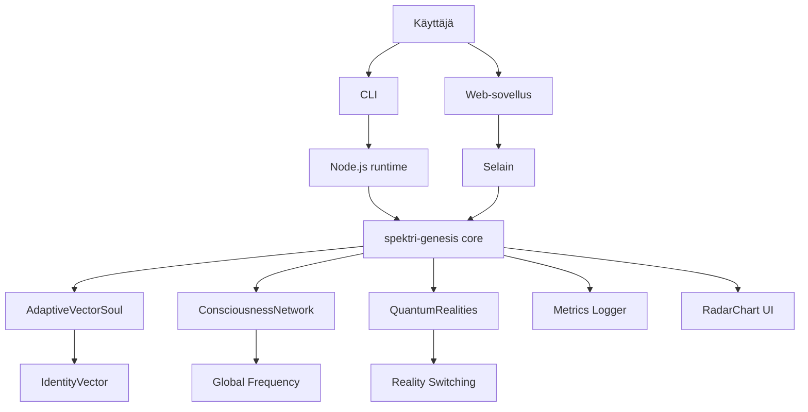

# Spektri Genesis v0.3.0 – Vector Identity & Metrics

## Executive Summary
Spektri-Genesis laajenee yksitaajuisesta sielumallista moniulotteiseen vektori-identiteettiin, jossa jokainen sielu on nyt kognitiivinen, emotionaalinen, henkinen ja eettinen vektori. Uusi trustEngineV2 yhdistää kosinietäisyyden ja taajuusmodulaation, metrics-loki mahdollistaa toistettavan analyysin, ja UI tukee sekä 3D- että radar-näkymiä. Kollektiivinen monimuotoisuus turvataan novelty-bonuksella ja entropy-regularisaatiolla.

## Uudet ydinkomponentit
- AdaptiveVectorSoul: moniulotteinen identiteetti, Hebb 2.0 -päivitys
- trustEngineV2: vektori- ja taajuusperusteinen resonanssi
- Metrics-loki: JSONL, siemenetty RNG, toistettavuus
- Radar-chart UI: visuaalinen vektoriprofiili
- Groupthink-jarru ja eettiset tasot

## Filosofinen pohja
- Diversiteetti ja harmonia: järjestelmä optimoi molempia
- Eettinen kehitys: tasot eivät ole arvojärjestys
- Emergenssi: kollektiivinen meditaatio ylläpitää monimuotoisuutta

## Arkkitehtuurikaavio

## Mittarit ja testit
- Harmony vs. Diversity (H–D): keskim. resonanssi ja vektorien entropia
- trustEngineV2: testit kosinietäisyydelle ja taajuusmodulaatiolle
- Hebb 2.0: vektorien lähentyminen, homeostaasi
- Groupthink-jarru: D ei laske alle baseline

## Tulevaisuuden suunta
- Neuroverkkoavusteinen optimointi
- Fyysinen EEG-integraatio
- Reality-mergen kaksoiskynnys
