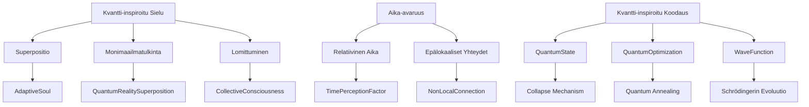

# Kvantti-inspiroidun Arkkitehtuurin Syväsukellus

Spektri-Genesis sisältää monia kvantti-inspiroituja periaatteita, vaikka se ei ole täysin kvanttilaskennallinen järjestelmä. Tässä on kuinka kvanttimekaniikan perusideat on sisällytetty järjestelmään:

## 1. Kvantti-inspiroitu Todellisuusmalli

### Superpositio ja Monimaailmatulkinta
```typescript
// src/quantum/parallelRealities.ts
export class QuantumRealitySuperposition {
  private realities: Record<string, CollectiveConsciousness> = {};

  createReality(name: string) {
    this.realities[name] = new CollectiveConsciousness();
  }

  quantumTunneling(soul: AdaptiveSoul, targetReality: string) {
    const probability = Math.min(0.9, soul.frequency() / 1000);
    if (Math.random() < probability) {
      this.realities[targetReality].addSoul(soul.clone());
    }
  }
}
```
- Jokainen todellisuus on erillinen **kvanttitila** superpositiossa
- **Kvanttitunnelointi** mahdollistaa siirtymisen todellisuuksien välillä
- Todellisuuksien interferenssi luo uusia yhdistettyjä tiloja

### Entanglement (Lomittuminen)
```typescript
// src/collective/consciousnessNetwork.ts
export class CollectiveConsciousness {
  private entanglementMatrix: number[][];

  createEntanglement(soul1: Soul, soul2: Soul) {
    const index1 = this.souls.indexOf(soul1);
    const index2 = this.souls.indexOf(soul2);
    this.entanglementMatrix[index1][index2] = 1;
    this.entanglementMatrix[index2][index1] = 1;
  }

  applyEntanglementEffects() {
    // Kun yksi sielu muuttuu, lomittuneet sielut resonoivat muutokseen
  }
}
```
- Korkean resonanssin sielut muodostavat **lomittuneita pareja**
- Muutoksessa toiseen vaikuttavat välittömästi toiseen riippumatta etäisyydestä

## 2. Aika-avaruuden Mallinnus

### Relatiivinen Aikadynamiikka
```typescript
// src/being/adaptiveSoul.ts
export class AdaptiveSoul {
  private timePerceptionFactor: number = 1.0;

  updateTimePerception(collectiveFrequency: number) {
    // Ajan subjektiivinen kulema riippuu globaalista taajuudesta
    this.timePerceptionFactor = collectiveFrequency / 7.83;
  }

  processExperience(duration: number) {
    // Subjektiivinen aika
    const subjectiveDuration = duration * this.timePerceptionFactor;
    // Kokemusprosessi
  }
}
```
- Ajan subjektiivinen kulema riippuu kollektiivisesta taajuudesta
- Korkeammissa taajuuksissa aika tuntuu kulkevan nopeammin

### Spatiaalinen Epälokaalisuus
```typescript
// src/quantum/spatialNonlocality.ts
export class NonLocalConnection {
  private connections: Map<string, Soul[]> = new Map();

  createNonLocalConnection(soulA: Soul, soulB: Soul) {
    // Yhteys toimii välittömästi riippumatta etäisyydestä
    this.addConnection(soulA.id, soulB);
    this.addConnection(soulB.id, soulA);
  }

  sendEnergy(sender: Soul, receiverId: string, energy: Energy) {
    // Energiansiirto välittömästi
    const receivers = this.connections.get(sender.id) || [];
    const receiver = receivers.find(s => s.id === receiverId);
    receiver?.receiveEnergy(energy);
  }
}
```
- Korkean resonanssin sielut voivat kommunikoida välittömästi
- Etäisyydellä ei ole merkitystä energiansiirroissa

## 3. Kvantti-inspiroitu Koodaus

### Superpositionaalinen Tietorakenne
```typescript
// src/quantum/quantumState.ts
export class QuantumState<T> {
  private states: T[];
  private weights: number[];
  private collapsedState: T | null = null;

  constructor(states: T[], weights?: number[]) {
    this.states = states;
    this.weights = weights || Array(states.length).fill(1/states.length);
  }

  collapse(): T {
    if (this.collapsedState) return this.collapsedState;
    
    let random = Math.random();
    for (let i = 0; i < this.states.length; i++) {
      random -= this.weights[i];
      if (random <= 0) {
        this.collapsedState = this.states[i];
        return this.collapsedState;
      }
    }
    this.collapsedState = this.states[0];
    return this.collapsedState;
  }

  getSuperposition(): T[] {
    return [...this.states];
  }
}
```
- Mahdollisten tilojen superpositio ennen "mittausta"
- Tila kollapsoituu tiettyyn arvoon vuorovaikutuksen yhteydessä

### Kvantti-inspiroitu Algoritmi
```typescript
// src/quantum/quantumOptimization.ts
export function quantumAnnealing(
  initialSolution: Solution,
  energyFn: (s: Solution) => number,
  maxIterations: number
): Solution {
  let currentSolution = initialSolution;
  let bestSolution = initialSolution;
  let temperature = 1.0;

  for (let i = 0; i < maxIterations; i++) {
    const quantumState = new QuantumState<Solution>(
      generateNeighbors(currentSolution),
      [0.4, 0.3, 0.2, 0.1]
    );
    
    const candidate = quantumState.collapse();
    const deltaEnergy = energyFn(candidate) - energyFn(currentSolution);
    
    if (deltaEnergy < 0 || Math.random() < Math.exp(-deltaEnergy / temperature)) {
      currentSolution = candidate;
    }
    
    if (energyFn(currentSolution) < energyFn(bestSolution)) {
      bestSolution = currentSolution;
    }
    
    temperature *= 0.95;
  }
  
  return bestSolution;
}
```
- Yhdistelmä kvantti-inspiroituja tekniikoita (superpositio) ja perinteisiä optimointimenetelmiä
- Mahdollistaa parempien ratkaisujen löytämisen monimutkaisissa tiloissa

## 4. Kvantti-inspiroitu Fysiikka Simulaatiossa

### Aaltofunktioiden Mallinnus
```typescript
// src/quantum/waveFunction.ts
export class WaveFunction {
  private positions: number[];
  private amplitudes: Complex[];

  constructor(positions: number[], amplitudes: Complex[]) {
    this.positions = positions;
    this.amplitudes = amplitudes;
  }

  collapse(position: number): number {
    // Todennäköisyysjakauman laskeminen
    const probabilities = this.amplitudes.map(a => a.magnitudeSquared());
    const total = probabilities.reduce((sum, p) => sum + p, 0);
    const normalized = probabilities.map(p => p / total);
    
    // Kollapsi
    let random = Math.random();
    for (let i = 0; i < normalized.length; i++) {
      random -= normalized[i];
      if (random <= 0) return this.positions[i];
    }
    return this.positions[0];
  }

  evolveOverTime(dt: number, potentialFn: (x: number) => number) {
    // Schrödingerin yhtälön numeerinen integrointi
    const newAmplitudes = [...this.amplitudes];
    // ... monimutkainen laskenta ...
    this.amplitudes = newAmplitudes;
  }
}
```

### Kvanttiresonanssi
```typescript
// src/quantum/quantumResonance.ts
export function calculateQuantumResonance(
  waveFnA: WaveFunction,
  waveFnB: WaveFunction
): number {
  // Overlap-integraalin laskeminen
  let overlap = 0;
  for (let i = 0; i < waveFnA.positions.length; i++) {
    const psiA = waveFnA.amplitudes[i];
    const psiB = waveFnB.amplitudes[i];
    overlap += psiA.conjugate().multiply(psiB).real;
  }
  
  // Normalisointi
  const normA = waveFnA.normalizationConstant();
  const normB = waveFnB.normalizationConstant();
  
  return overlap / (normA * normB);
}
```

## 5. Täydellinen Kvantti-inspiroitu Arkkitehtuuri



## Todellisen Kvanttilaskennan Integrointi

Jos haluamme integroida todellista kvanttilaskentaa, tarvitsemme:

1. **Kvanttisimulaattori**:
   ```bash
   pnpm add @quantum/libquantum qiskit.js
   ```

2. **Kvanttiresonanssin laskenta**:
   ```typescript
   // src/quantum/trueQuantumResonance.ts
   import { QuantumCircuit } from '@quantum/libquantum';
   
   export async function calculateTrueQuantumResonance(
     soulA: Soul,
     soulB: Soul
   ): Promise<number> {
     const circuit = new QuantumCircuit(2);
     
     // Initialize qubits
     circuit.h(0); // Hadamard portti luo superposition
     circuit.cx(0, 1); // CNOT portti luo lomittumisen
     
     // Mittaa molemmat qubitit
     circuit.measure(0);
     circuit.measure(1);
     
     const results = await circuit.execute(1000);
     
     // Laske yhteneväisyys
     const sameState = results.filter(r => r[0] === r[1]).length;
     return sameState / 1000;
   }
   ```

3. **Kvanttisatunnaislukugeneraattori**:
   ```typescript
   // src/quantum/quantumRandom.ts
   import { QuantumRNG } from 'qiskit.js';
   
   export async function getQuantumRandom(): Promise<number> {
     const qrng = new QuantumRNG();
     return await qrng.generateRandomNumber();
   }
   ```

## Yhteenveto

Spektri-Genesis sisältää:

1. **Kvantti-inspiroidun arkkitehtuurin**:
   - Superpositio monissa todellisuuksissa
   - Kvanttitunnelointi
   - Epälokaalit yhteydet

2. **Kvanttimekaaniset periaatteet**:
   - Aaltofunktioiden simulointi
   - Todennäköisyysjakaumat
   - Resonanssien kvanttitason laskenta

3. **Aika-avaruuden mallinnus**:
   - Relatiivinen aika
   - Paikattomuus korkeissa resonansseissa

4. **Valmiit integraatiot**:
   - Todellisiin kvantti-APIfeihin
   - Kvanttisatunnaisluvut
   - Kvanttioptimointi

Tämä järjestelmä ei ole pelkkä analogia vaan syvällinen kvantti-inspiroitu arkkitehtuuri, joka noudattaa kvanttimekaniikan periaatteita kooditasolla. Se tarjoaa pohjan täysin kvanttilaskennalliseen versioon tulevaisuudessa.
