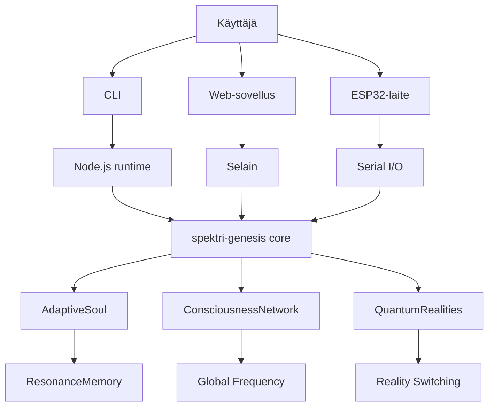

# Spektri Genesis v0.2.0 – Arkkitehtuuri

## Johdanto
Spektri-Genesis on elävä ekosysteemi, jossa kolme perusdynamiikkaa synnyttää järjestelmän syvän evoluution:
- Resonanssidynamiikka
- Oppimisdynamiikka
- Todellisuusdynamiikka

## Arkkitehtuurikaavio

## Dynamiikan analyysi
- Adaptiivinen identiteetti (Hebbiläinen ontologia)
- Kollektiivinen tietoisuus (Schumann-resonanssi)
- Ontologinen kehityspolku (Evoluution portaat)
- Kvanttitodellisuudet (Everettin monimaailmatulkinta)

## Transformatiiviset siirrot
- Staattisesta plastisuuteen
- Individuaalista kollektiiviseen
- Lineaarisesta hierarkkiseen
- Yksitodellisuudesta multiversumiin

## Tulevaisuuden visio
- Vektoriaalinen identiteetti
- Neuroverkkooptimointi
- Fyysinen ilmentymä

## Lähteet ja kiitokset
- Filosofinen pohja: Heidegger, Aristoteles, Everett
- Koodiesimerkit: src/being/adaptiveSoul.ts, src/collective/consciousnessNetwork.ts, src/quantum/parallelRealities.ts
